# Sprint Game Manager (SGM)

Desktop GUI for managing Intellivision Sprint Console games (ROM, config, metadata, and images) for sideloading.

**Supported Platforms:** Windows, macOS, Linux

## Architecture

```mermaid
flowchart TB
    subgraph UI["🖥️ PySide6 GUI"]
        MenuBar["📑 Menu Bar<br/>(Linux)"]
        Search["🔍 Search/Filter"]
        GameList["📋 Game List Panel"]
        Details["📝 Details Panel"]
        Metadata["✏️ Metadata Editor"]
        ImageCards["🖼️ Image Cards"]
        StatusBar["📊 Status Bar"]
    end

    subgraph Core["⚙️ Core Logic"]
        FileOps["📁 File Operations"]
        Validation["🔍 Resolution Validation"]
        Config["⚡ Config Manager<br/>(sgm.ini)"]
        Themes["🎨 Theme Engine<br/>(6 themes)"]
        Duplicates["🔎 Duplicate Detection"]
    end

    subgraph Assets["🎮 Game Assets"]
        ROM["💾 .bin / .int / .rom"]
        CFG["📄 .cfg"]
        JSON["📋 .json metadata"]
        Images["🎨 PNG images<br/>(box, overlay, snap, qr)"]
    end

    MenuBar --> FileOps
    Search --> GameList
    GameList --> FileOps
    Details --> FileOps
    Metadata --> JSON
    ImageCards --> Validation
    Validation --> Images
    FileOps --> ROM
    FileOps --> CFG
    Config --> UI
    Themes --> UI
    Duplicates --> GameList

    style UI fill:#1e3a5f,stroke:#3b82f6,stroke-width:2px,color:#fff
    style Core fill:#3b1f5f,stroke:#a855f7,stroke-width:2px,color:#fff
    style Assets fill:#1f4f3a,stroke:#22c55e,stroke-width:2px,color:#fff
    
    style MenuBar fill:#2563eb,stroke:#60a5fa,color:#fff
    style Search fill:#2563eb,stroke:#60a5fa,color:#fff
    style GameList fill:#2563eb,stroke:#60a5fa,color:#fff
    style Details fill:#2563eb,stroke:#60a5fa,color:#fff
    style Metadata fill:#2563eb,stroke:#60a5fa,color:#fff
    style ImageCards fill:#2563eb,stroke:#60a5fa,color:#fff
    style StatusBar fill:#2563eb,stroke:#60a5fa,color:#fff
    
    style FileOps fill:#7c3aed,stroke:#a78bfa,color:#fff
    style Validation fill:#7c3aed,stroke:#a78bfa,color:#fff
    style Config fill:#7c3aed,stroke:#a78bfa,color:#fff
    style Themes fill:#7c3aed,stroke:#a78bfa,color:#fff
    style Duplicates fill:#7c3aed,stroke:#a78bfa,color:#fff
    
    style ROM fill:#16a34a,stroke:#4ade80,color:#fff
    style CFG fill:#16a34a,stroke:#4ade80,color:#fff
    style JSON fill:#16a34a,stroke:#4ade80,color:#fff
    style Images fill:#16a34a,stroke:#4ade80,color:#fff
```



## New Features

### Theme Support
Choose from 6 built-in themes via the dropdown in the top-right corner. Theme selection is saved to your config and persists across sessions.


| Theme | Style | Background | Accent |
|-------|-------|------------|--------|
| **System** | Native OS | - | - |
| **Dark** | Catppuccin Mocha | Deep purple | Blue |
| **Light** | Catppuccin Latte | Soft gray | Blue |
| **Nord** | Arctic | Blue-gray | Cyan |
| **Dracula** | Vampire | Dark purple | Purple |
| **Gruvbox** | Retro | Brown | Yellow |

### Search & Filter
Quickly find games using the search box above the games list:
- Real-time filtering as you type
- Case-insensitive matching
- Auto-expands folders containing matches
- Shows filtered count (e.g., "Games: 42/447")

### Duplicate Detection
Find games with similar or duplicate names via **Tools → Find Duplicates**:
- Detects exact matches (ignoring case, symbols, and suffixes like "(Hack)")
- Detects similar names (>85% match)
- Double-click a result to jump to that game

### Status Bar
Shows current operation status at the bottom of the window:
- Loading progress
- Game counts
- Operation feedback

### Context Menu
Right-click on folders or games in the list:
- **Open in File Manager** - Jump directly to the folder location

### Linux Enhancements
- **Menu Bar** - Full menu (File, Tools, View, Help) with keyboard shortcuts
- **XDG Compliance** - Config stored in `~/.config/sgm/`
- **HiDPI Support** - Auto-scaling for high-resolution displays
- **Wayland Support** - Native Wayland hints
- **GTK File Dialogs** - Native file dialogs on GTK desktops
- **Desktop Integration** - Install script with system-wide option (`-s` flag)

## Using the app (end users)

### 1) Pick your games folder
- Use the folder picker to choose the root folder that contains your game files.
- The game list populates from the detected basenames.

### 2) Select a game
- Click a game to edit its assets.
- The top-left warning counter reflects missing/invalid assets (including image resolution mismatches).

### Analyze the games folder
- Use the **Analyze** area to scan the currently selected games folder and compute warnings per game.
- Use the warning filters to show only specific issues (missing ROM/config/metadata/images, resolution mismatches, etc.).
- Enable **Only games with warnings** to quickly narrow the game list.
- Use the **select all / clear all** filter buttons to toggle filters faster.
- If you add/rename files, re-run Analyze (or Refresh) to update results.

### 3) Add / rename content
- Drag & drop accepted files into the app (or use the Add actions) to copy them into the selected game.
- Use **Change File Name** to rename the game (updates associated files).

### 4) Edit metadata
- Use the metadata editor panel to create/edit `<basename>.json` and save changes.

### 5) Manage images
Each image card supports:
- **Browse**: pick an image file.
- **Paste**: paste an image from the clipboard.
- **Drag & drop**: drop an image file onto the card.
- **Resize** (when shown): fixes wrong-resolution PNGs.

### 6) Overlays (1–3)
- **Build**: generate an overlay from a template + bottom image.
- **Blank**: sets the slot to the packaged empty overlay image.
- **Keep Ratio** (overlay cards only): when checked, Browse/Paste keeps the source aspect ratio and centers it on a transparent canvas (no stretching).
- **Reorder overlays**: if at least two overlay files exist, drag one overlay card onto another to swap/move their underlying files.

### 7) Snapshots (1–3)
- If you have multiple snap images, drag one snap card onto another to swap/move `_snap1/_snap2/_snap3`.

### 8) QR code
- Use the QR tools to generate/update the game QR image (including URL-based creation).

### Folder support
- The app supports a folder-per-game layout. Each game's files (ROM, .cfg, .json metadata, PNGs) live alongside a common basename.
- You can add or move games between folders; the UI preserves metadata and assets when renaming or moving files.
- Hidden folders (starting with `.`) are ignored. On Windows, filesystem-hidden folders are also respected.

### Advanced JSON settings
- Use the **Advanced** button in the metadata editor to open the Advanced JSON dialog for more specialized fields such as `save_highscores` and `jzintv_extra` file references.
- Advanced mode shows raw JSON editing of the metadata while preserving other keys when saving. Use it when you need to add custom keys or tweak nested structures.
- When editing JSON directly, the app validates basic structure but does not run schema-level validation — double-check any complex edits.

### JSON Bulk Updater
- Launch the JSON Bulk Updater from the `JSON Bulk Update` button under the Games list (below the Analyze controls).
- Purpose: visualize a selected JSON field across all games, preview proposed changes, and apply updates in bulk while preserving unrelated keys.
- Steps:
	1. Choose the **Field to Update** (standard fields like Players, Year, or `Other` for a custom key).
	2. Select a **Bulk Update Option** (No Change, Set Value, Replace/Prefix/Append Text, Remove Entry, or Regular Expression).
	3. If applicable, supply option inputs (Value, Find/Replace, Prefix, Append, or Regex pattern/replacement).
	4. Use the **Preview Updates** button to build a table showing Current vs New values for all games. Filter by Name/Path or Current Value to narrow the preview.
	5. Toggle the **Include** checkbox per-row to control which rows will be written. The label next to Perform Updates shows how many visible rows will be applied.
	6. Click **Perform Updates** to write changes — only included and visible rows are processed. The dialog preserves other JSON keys and refreshes to show the post-update state.

Tips:
- Prefix/Append: when applying a Prefix or Append to an empty or `<Not Defined>` current value, the updater trims leading/trailing whitespace from your input so you don't end up with stray spaces.
- Use the `...` buttons in table cells to view or edit full values in a popup when needed.
- Filters default to "Contains" to make searching easier; use the Clear Filters button (✕) to reset filters quickly.

## Technical (developers)

### Setup

```powershell
. .\.venv\Scripts\Activate.ps1
pip install -r requirements.txt
```

### Run

```powershell
python main.py
```

### Build standalone executable

#### Windows

```powershell
. .\.venv\Scripts\Activate.ps1
pip install -r requirements.txt
pip install -r requirements-build.txt
./build_exe.ps1
```

Output: `dist\SprintGameManager.exe`

#### Linux

```bash
source .venv/bin/activate
pip install -r requirements.txt
pip install -r requirements-build.txt
./build_exe_linux.sh
```

Output: `dist/SprintGameManager`

#### macOS

```bash
source .venv/bin/activate
pip install -r requirements.txt
pip install -r requirements-build.txt
./build_exe_mac.sh
```

Output: `dist/SprintGameManager.app`

### App config

On first run, the app creates `sgm.ini` in the current working directory (project root by default). It stores settings like `LastGameFolder`, expected image resolutions, and overlay template override settings.
